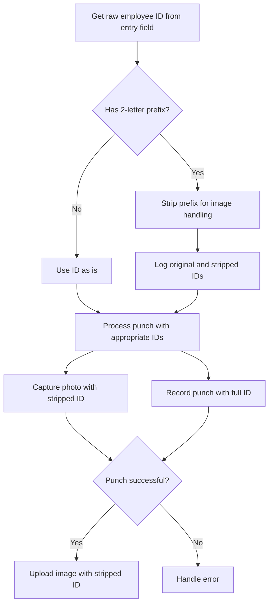

# Barcode Scanner Image Upload Fix Plan

## Problem Statement

When using a barcode scanner to read barcodes into the ID Entry field, the punch gets processed, but no image is taken or sent to the system. However, when the ID is manually typed and Enter is pressed, the image is captured and properly sent.

The root cause has been identified: The barcode contains a 2-letter prefix (like "TE" or "TC") which is included in the filename when the image is saved locally. For example, instead of the filename being "00700**20250321_134006.jpg", it is saved as "TE00700**20250321_134006.jpg". When the system tries to access the image on the web portal, it's looking for the image without the prefix, causing the mismatch.

## Solution Approach

We need to modify the code to handle the prefix properly. The best approach is to strip the 2-letter prefix from the employee ID before using it for image naming and uploading, while preserving the full ID for the punch record if needed.

## Implementation Plan

### 1. Modify the `process_punch` method in `time_clock_ui.py`



### 2. Code Changes Required

1. In `time_clock_ui.py`, modify the `process_punch` method to:

   - Detect if the employee ID starts with a 2-letter prefix
   - Strip the prefix for image handling
   - Use the appropriate ID format for each operation
   - Log the original and stripped IDs for debugging

2. Ensure the `soap_client._upload_image` method uses the stripped ID for the image filename

### 3. Testing Plan

1. Test with barcode scanner:

   - Scan a barcode with a 2-letter prefix
   - Verify the punch is processed correctly
   - Verify the image is captured and uploaded with the correct filename

2. Test with manual entry:

   - Enter an ID manually (with and without prefix)
   - Verify the punch is processed correctly
   - Verify the image is captured and uploaded with the correct filename

3. Verify in logs:
   - Check that the prefix stripping is logged correctly
   - Confirm the image upload uses the correct filename

## Implementation Details

Here's the specific code change needed in `time_clock_ui.py`:

```python
def process_punch(self, event=None):
    """Process an employee punch"""
    import threading

    # Get the raw employee ID
    raw_employee_id = self.employee_id.get().strip()
    if not raw_employee_id:
        return

    # Strip the 2-letter prefix if present (for image handling)
    image_employee_id = raw_employee_id
    if len(raw_employee_id) >= 2 and raw_employee_id[:2].isalpha():
        image_employee_id = raw_employee_id[2:]
        logger.info(f"Stripped prefix from ID for image handling: {raw_employee_id} -> {image_employee_id}")

    # Clear entry field immediately
    self.employee_id.set("")
    self.update()  # Force update to show cleared entry

    # Set temporary status
    self.set_status(
        "Processing...",
        "Procesando...",
        StatusColors.NORMAL
    )

    def process_in_thread():
        try:
            # Get current time once to use for both punch and photo
            punch_time = datetime.now()

            # Capture photo first with the timestamp - use stripped ID for image
            photo_data = self.camera_service.capture_photo(image_employee_id, punch_time)

            # Record punch with same timestamp - use full ID for punch
            response = self.soap_client.record_punch(
                employee_id=raw_employee_id,
                punch_time=punch_time
            )

            # If punch was successful, upload the photo with same timestamp - use stripped ID for image
            if response['success'] and photo_data:
                self.soap_client._upload_image(image_employee_id, photo_data, punch_time)

            # Update UI in main thread
            def update_ui():
                # ... (rest of the method remains unchanged)

            # Schedule UI update in main thread
            self.after(0, update_ui)

        except Exception as e:
            logger.error(f"Error processing punch: {e}")
            def show_error():
                self.set_status(
                    "System Error - Please try again",
                    "Error del sistema - Por favor intente de nuevo",
                    StatusColors.ERROR
                )
                # Reset UI after delay
                self.after(3000, self.reset_ui)
            self.after(0, show_error)

    # Start processing in separate thread
    thread = threading.Thread(target=process_in_thread)
    thread.daemon = True  # Thread will be terminated when main program exits
    thread.start()
```

## Expected Outcome

After implementing this solution:

1. Barcode scanner punches will correctly capture and upload images
2. Manual entry punches will continue to work as before
3. The system will properly associate images with punches regardless of input method
4. The logs will show the ID transformation for debugging purposes

## Potential Considerations

1. If the server expects the full ID (with prefix) for other operations, we need to ensure we're only stripping it for image handling
2. We should monitor the logs after implementation to ensure the prefix stripping is working correctly
3. If there are other places in the code that handle employee IDs and images, they may need similar modifications
