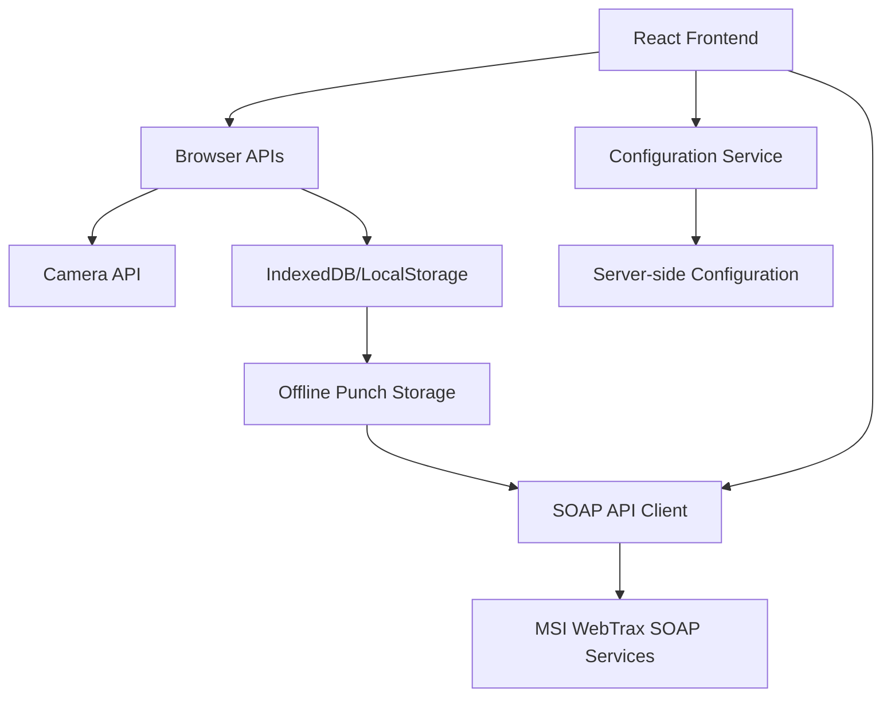
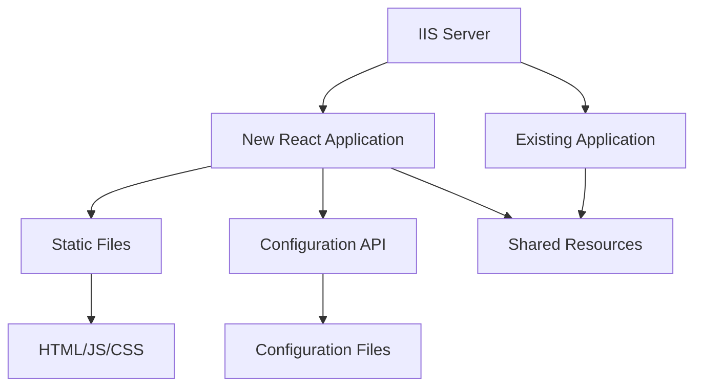

# MSI Clock 2025 - React Conversion Plan (Updated)

## Project Overview

This document outlines the plan to convert the current Ubuntu-based MSI Clock application to a modern React application. The conversion will maintain the existing SOAP API integration while implementing the UI design provided in the reactFrontend.js file.

## Current Environment

Based on the latest information:

1. The current web application is hosted on a Windows server using IIS (Internet Information Services)
2. The application is stored in an "inetpub" directory, which contains a "wwwroot" folder
3. The new React application needs to run alongside the existing application

## Current Application Overview

The current MSI Clock application is a Ubuntu-based time clock system with the following components:

1. **Frontend**: Python-based UI using CustomTkinter
2. **Camera Integration**: OpenCV for webcam access and photo capture
3. **API Communication**: SOAP client for punch recording
4. **Offline Storage**: Local JSON storage for offline punches
5. **Admin Panel**: Configuration interface for system settings

## Target Architecture

Given the requirement to run alongside the existing web application on an IIS server, we'll implement a web-based React application that can be deployed to the same server. This changes our approach from the previous plan:



### Deployment Architecture



## UI Implementation

We will use the provided reactFrontend.js file as the foundation for our UI. This file already includes:

1. **Modern Design**: Clean, responsive layout using Tailwind CSS
2. **Time Display**: Formatted date and time display
3. **Employee ID Input**: Numeric keypad with clear, backspace, and submit functions
4. **Camera Integration**: Webcam preview using the browser's MediaDevices API
5. **Error Handling**: Camera error display and fallback UI

The UI from reactFrontend.js will be extended to include:

1. **Admin Panel**: A protected interface for configuration
2. **Status Messages**: Enhanced feedback for punch operations
3. **Offline Indicators**: Visual cues for offline mode
4. **Settings Management**: UI for updating configuration

## Credential Storage Approach

Since we're deploying to an IIS server, we'll need to adjust our credential storage approach. Options include:

1. **Server-side Configuration Files**:

   - Store credentials in configuration files on the server
   - Create a small API endpoint to securely provide credentials to the application
   - Implement proper authentication for accessing these endpoints

2. **Web.config Approach**:

   - Use IIS's web.config for storing encrypted connection strings
   - Create a small ASP.NET handler to securely provide these to the client

3. **Shared Configuration Service**:
   - Create a shared configuration service that both applications can use
   - Implement proper authentication and encryption

For this plan, we'll use the Server-side Configuration Files approach, as it provides a good balance of security and simplicity.

## Conversion Plan

### Phase 1: Project Setup and IIS Integration (2-3 weeks)

1. **Set Up React Project**

   - Create a new React project using Create React App with TypeScript
   - Set up Tailwind CSS for styling
   - Import and integrate the UI from reactFrontend.js as the starting point
   - Configure project structure with components, services, and utilities folders

2. **IIS Deployment Configuration**

   - Determine the appropriate URL path for the new application
   - Configure the build process to output to the correct location
   - Set up IIS rewrite rules if needed for routing
   - Create deployment scripts for easy updates

3. **Configuration Service**
   - Create a small server-side API for securely accessing configuration
   - Implement authentication for the configuration API
   - Create a client-side service for interacting with the configuration API
   - Set up default configuration values

### Phase 2: Core UI Components (1-2 weeks)

1. **Refine Existing UI Components**

   - Break down the reactFrontend.js into smaller, reusable components
   - Ensure proper TypeScript typing for all components
   - Implement responsive design improvements if needed

2. **Extend UI for Additional Features**
   - Create an admin panel component that matches the main UI style
   - Add status message components for operation feedback
   - Implement offline mode indicators
   - Create settings management UI components

### Phase 3: SOAP API Integration (2-3 weeks)

1. **SOAP Client Implementation**

   - Create a browser-compatible SOAP client service
   - Implement XML generation and parsing for SOAP requests/responses
   - Add error handling and retry mechanisms
   - Create wrapper functions for specific API operations

2. **Authentication**

   - Implement secure loading of credentials from the configuration service
   - Create authentication mechanisms for SOAP API
   - Add session management

3. **Punch Recording**

   - Implement the punch recording workflow
   - Connect the submit button from the UI to the SOAP client
   - Add response handling and user feedback
   - Implement error handling and fallback to offline mode

4. **Image Upload**
   - Implement photo capture from the video stream
   - Create image upload functionality for the SOAP API
   - Add compression and optimization for better performance

### Phase 4: Offline Capabilities (1-2 weeks)

1. **Local Storage**

   - Implement IndexedDB for storing punch data
   - Create data models for offline storage
   - Add data expiration and cleanup mechanisms

2. **Synchronization**

   - Implement background synchronization for offline punches
   - Create queue management for pending uploads
   - Add conflict resolution for sync issues

3. **Connection Management**
   - Implement online/offline detection
   - Create visual indicators for connection status
   - Add automatic retry mechanisms

### Phase 5: Admin Interface (1-2 weeks)

1. **Admin Panel**

   - Create a protected admin route
   - Implement authentication for admin access
   - Design the admin interface layout matching the main UI style

2. **Settings Management**

   - Create forms for configuring application settings
   - Implement validation for settings
   - Add save and reset functionality
   - Implement secure updating of credentials via the configuration service

3. **System Diagnostics**
   - Create components for viewing system status
   - Implement connection testing
   - Add camera testing functionality

### Phase 6: Testing and Refinement (2-3 weeks)

1. **Unit Testing**

   - Write tests for individual components
   - Create tests for service functions
   - Implement mocks for external dependencies

2. **Integration Testing**

   - Test the complete punch recording workflow
   - Verify offline functionality
   - Test synchronization mechanisms

3. **Cross-Browser Testing**

   - Ensure compatibility with major browsers
   - Test on different devices and screen sizes
   - Address any browser-specific issues

4. **Performance Optimization**
   - Optimize component rendering
   - Improve image processing performance
   - Reduce bundle size through code splitting

### Phase 7: Deployment and Documentation (1-2 weeks)

1. **Build Configuration**

   - Create production build settings
   - Optimize assets for production
   - Implement caching strategies

2. **IIS Deployment**

   - Create detailed deployment instructions for IIS
   - Set up URL rewriting rules if needed
   - Configure proper MIME types and HTTP headers
   - Set up automated deployment process

3. **Documentation**
   - Create user documentation
   - Document configuration options
   - Provide troubleshooting guides
   - Create admin documentation for credential management

## Technical Considerations

### IIS Integration

Since the application will be hosted on IIS alongside an existing application:

1. **URL Path Configuration**

   - Determine if the new application will be hosted at a subdirectory (e.g., /msiclock/)
   - Configure React Router to work with the subdirectory path
   - Set up proper base URL for all assets

2. **Static File Serving**

   - Configure IIS to properly serve static files for the React application
   - Set up appropriate cache headers for optimal performance
   - Configure MIME types for all asset types

3. **API Endpoints**
   - Determine how API endpoints will be structured
   - Configure CORS if needed for cross-origin requests
   - Set up proper authentication for API access

### Credential Security

For the server-side configuration approach:

1. **Encryption at Rest**

   - Store sensitive data (username, password) encrypted in the configuration files
   - Use strong encryption algorithms (AES-256)
   - Secure the encryption keys properly

2. **Access Control**

   - Restrict access to configuration files using file system permissions
   - Implement proper authentication for the configuration API
   - Use HTTPS for all communication

3. **Secure API Design**
   - Design the configuration API to minimize exposure of sensitive data
   - Implement rate limiting to prevent brute force attacks
   - Log access attempts for security auditing

### Browser Compatibility

- Target modern browsers (Chrome, Firefox, Edge, Safari)
- Implement polyfills for essential features if needed
- Test thoroughly on all target platforms

### Performance

- Optimize React component rendering
- Implement lazy loading for non-critical components
- Optimize image handling for camera functionality
- Use web workers for intensive operations

### Offline Functionality

- Use IndexedDB for robust offline storage
- Implement background sync when possible
- Create clear user feedback for offline mode
- Handle edge cases for network connectivity issues

## Implementation Details

### Configuration Service

We'll create a small server-side API for securely accessing configuration:

```csharp
// Example ASP.NET Core API endpoint (can be implemented in other technologies as well)
[ApiController]
[Route("api/config")]
[Authorize]
public class ConfigController : ControllerBase
{
    private readonly IConfiguration _configuration;
    private readonly IEncryptionService _encryptionService;

    public ConfigController(IConfiguration configuration, IEncryptionService encryptionService)
    {
        _configuration = configuration;
        _encryptionService = encryptionService;
    }

    [HttpGet("soap")]
    public ActionResult<SoapConfig> GetSoapConfig()
    {
        // Get encrypted values from configuration
        var encryptedUsername = _configuration["Soap:Username"];
        var encryptedPassword = _configuration["Soap:Password"];

        // Decrypt for client use
        return new SoapConfig
        {
            Username = _encryptionService.Decrypt(encryptedUsername),
            Password = _encryptionService.Decrypt(encryptedPassword),
            Endpoint = _configuration["Soap:Endpoint"],
            Timeout = int.Parse(_configuration["Soap:Timeout"] ?? "30"),
            ClientId = int.Parse(_configuration["Soap:ClientId"] ?? "185")
        };
    }
}
```

On the client side, we'll create a service to interact with this API:

```typescript
export class ConfigService {
  private config: any = null;
  private isLoading: boolean = false;
  private loadPromise: Promise<any> | null = null;

  async getConfig(): Promise<any> {
    if (this.config) {
      return this.config;
    }

    if (this.isLoading) {
      return this.loadPromise;
    }

    this.isLoading = true;
    this.loadPromise = fetch("/api/config/soap", {
      credentials: "include", // Include cookies for authentication
      headers: {
        Accept: "application/json",
      },
    })
      .then((response) => {
        if (!response.ok) {
          throw new Error(`Failed to load configuration: ${response.status}`);
        }
        return response.json();
      })
      .then((config) => {
        this.config = config;
        return config;
      })
      .finally(() => {
        this.isLoading = false;
      });

    return this.loadPromise;
  }
}
```

### Extending the reactFrontend.js UI

The provided reactFrontend.js will be used as the foundation, with the following extensions:

1. **Add SOAP Integration to Submit Handler**:

```typescript
const handleKeyPress = (value: string) => {
  if (value === "clear") {
    setEmployeeId("");
  } else if (value === "backspace") {
    setEmployeeId((prev) => prev.slice(0, -1));
  } else if (value === "submit") {
    // Handle submit logic with SOAP integration
    setIsSubmitting(true);
    soapClient
      .recordPunch(employeeId, new Date())
      .then((response) => {
        setStatusMessage(
          response.success
            ? `Punch recorded for ${response.firstName} ${response.lastName}`
            : `Error: ${response.message}`
        );
        setStatusType(response.success ? "success" : "error");
        if (response.success) {
          setEmployeeId("");
        }
      })
      .catch((error) => {
        setStatusMessage(`Error: ${error.message}`);
        setStatusType("error");
      })
      .finally(() => {
        setIsSubmitting(false);
      });
  } else {
    setEmployeeId((prev) => (prev.length < 10 ? prev + value : prev));
  }
};
```

2. **Add Status Message Component**:

```tsx
const StatusMessage = ({ type, message, messageEs }) => {
  if (!message) return null;

  const bgColor =
    type === "success"
      ? "bg-green-600"
      : type === "warning"
      ? "bg-yellow-600"
      : "bg-red-600";

  return (
    <div className={`${bgColor} p-4 rounded-lg text-white mb-4`}>
      <p className="text-lg font-bold">{message}</p>
      {messageEs && <p className="text-md">{messageEs}</p>}
    </div>
  );
};
```

3. **Add Admin Button**:

```tsx
<header className="bg-black bg-opacity-50 p-4">
  <div className="container mx-auto flex items-center justify-between">
    <div className="flex items-center gap-4">
      
      <h1 className="text-2xl font-bold">MSI Strategic Staffing</h1>
    </div>
    <button
      onClick={showAdminPanel}
      className="bg-[#333333] hover:bg-[#444444] text-white p-2 rounded-lg"
    >
      Admin
    </button>
  </div>
</header>
```

### SOAP API Integration

We'll create a SOAP client service that can be used with the React UI:

```typescript
export class SoapClient {
  private config: any;
  private isOnline: boolean = false;
  private connectionError: string | null = null;

  constructor(config: any) {
    this.config = config;
  }

  async recordPunch(
    employeeId: string,
    punchTime: Date,
    departmentOverride?: number
  ): Promise<any> {
    try {
      // Format the swipe input string
      const swipeInput = `${employeeId}|*|${punchTime.toISOString()}${
        departmentOverride ? `|*|${departmentOverride}` : ""
      }`;

      // Create SOAP envelope
      const soapEnvelope = this.createSoapEnvelope("RecordSwipeSummary", {
        swipeInput,
      });

      // Send request
      const response = await this.sendSoapRequest(
        `${this.config.endpoint}Services/MSIWebTraxCheckInSummary.asmx`,
        soapEnvelope
      );

      // Parse response
      const result = this.parseSoapResponse(response);

      // Capture photo and upload if punch was successful
      if (result.success) {
        const imageData = await this.capturePhoto();
        if (imageData) {
          await this.uploadImage(employeeId, imageData, punchTime);
        }
      }

      return result;
    } catch (error) {
      console.error("Error recording punch:", error);

      // Store offline if online request fails
      return this.storeOfflinePunch(employeeId, punchTime);
    }
  }

  // Other methods for SOAP communication, offline storage, etc.
}
```

## Timeline

| Phase | Description                       | Duration  | Dependencies |
| ----- | --------------------------------- | --------- | ------------ |
| 1     | Project Setup and IIS Integration | 2-3 weeks | None         |
| 2     | Core UI Components                | 1-2 weeks | Phase 1      |
| 3     | SOAP API Integration              | 2-3 weeks | Phase 1      |
| 4     | Offline Capabilities              | 1-2 weeks | Phases 2, 3  |
| 5     | Admin Interface                   | 1-2 weeks | Phases 1, 3  |
| 6     | Testing and Refinement            | 2-3 weeks | Phases 1-5   |
| 7     | Deployment and Documentation      | 1-2 weeks | Phases 1-6   |

**Total Estimated Time**: 10-17 weeks

## Risk Assessment and Mitigation

| Risk                                      | Impact | Probability | Mitigation                                                                  |
| ----------------------------------------- | ------ | ----------- | --------------------------------------------------------------------------- |
| IIS integration issues                    | High   | Medium      | Early testing with IIS deployment; create detailed deployment documentation |
| SOAP API compatibility issues             | High   | Medium      | Early testing with actual API endpoints; fallback mechanisms                |
| Browser camera API limitations            | Medium | Medium      | Comprehensive testing across browsers; fallback UI for unsupported browsers |
| Offline sync conflicts                    | Medium | Low         | Robust conflict resolution; clear user feedback                             |
| Performance issues on older devices       | Medium | Medium      | Progressive enhancement; performance optimization                           |
| Security concerns with credential storage | High   | Medium      | Implement strong encryption; restrict API access                            |

## Next Steps

1. Gather more information about the existing IIS environment:

   - IIS version
   - URL structure for the existing application
   - Authentication mechanisms in use
   - Any existing API endpoints that could be leveraged

2. Set up a development environment that mimics the production IIS setup

3. Create a proof-of-concept for the React application with IIS deployment

4. Implement the configuration service and test SOAP API integration

5. Begin full implementation following the phased approach outlined above
