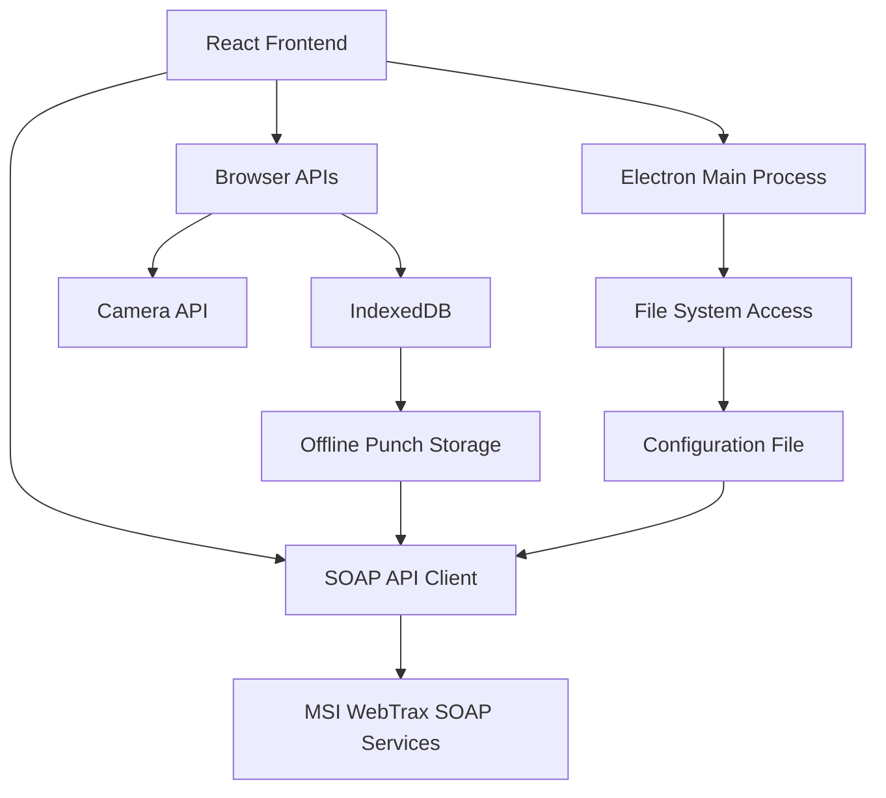
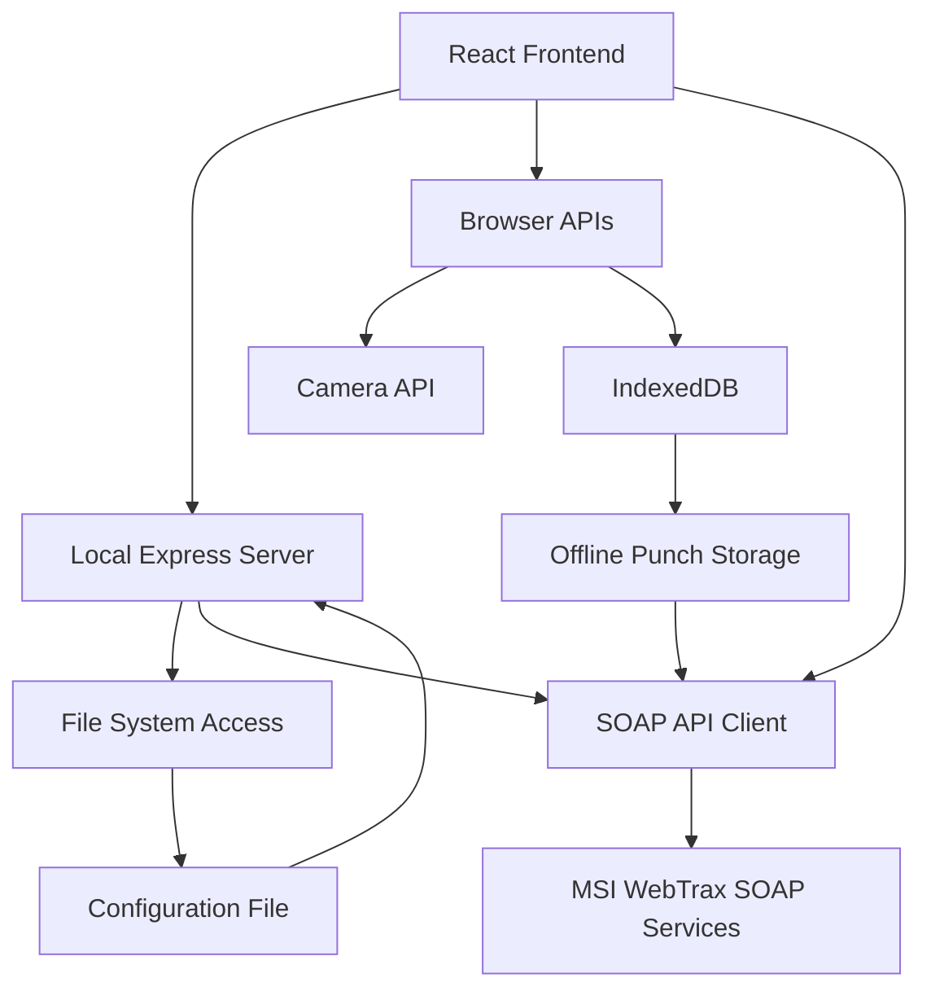

# MSI Clock 2025 - React Conversion Plan

## Project Overview

This document outlines the plan to convert the current Ubuntu-based MSI Clock application to a modern React application. The conversion will maintain the existing SOAP API integration while implementing the UI design provided in the reactFrontend.js file.

## Current Application Overview

The current MSI Clock application is a Ubuntu-based time clock system with the following components:

1. **Frontend**: Python-based UI using CustomTkinter
2. **Camera Integration**: OpenCV for webcam access and photo capture
3. **API Communication**: SOAP client for punch recording
4. **Offline Storage**: Local JSON storage for offline punches
5. **Admin Panel**: Configuration interface for system settings

## Target Architecture

The new architecture will be a React application that communicates directly with the SOAP API. It will include basic offline capabilities for storing recent punches locally and syncing when a connection is available.

Based on the requirement to store credentials in a configuration file on each computer, we will implement one of the following approaches:

### Option 1: Electron-based Desktop Application



### Option 2: React Frontend with Minimal Local Server



## UI Implementation

We will use the provided reactFrontend.js file as the foundation for our UI. This file already includes:

1. **Modern Design**: Clean, responsive layout using Tailwind CSS
2. **Time Display**: Formatted date and time display
3. **Employee ID Input**: Numeric keypad with clear, backspace, and submit functions
4. **Camera Integration**: Webcam preview using the browser's MediaDevices API
5. **Error Handling**: Camera error display and fallback UI

The UI from reactFrontend.js will be extended to include:

1. **Admin Panel**: A protected interface for configuration
2. **Status Messages**: Enhanced feedback for punch operations
3. **Offline Indicators**: Visual cues for offline mode
4. **Settings Management**: UI for updating configuration

## Credential Storage Approach

As requested, we will store credentials (username, password, client_id) in a configuration file on each computer, similar to the current application's settings.json approach. This will require:

1. For an Electron-based solution:

   - Using Electron's file system API to read/write the configuration file
   - Implementing encryption for sensitive data in the configuration file
   - Creating an admin interface for updating credentials

2. For a React + Local Server solution:
   - Creating a minimal Express server that runs locally
   - Implementing secure API endpoints for reading configuration
   - Using environment variables or secure storage for encryption keys

The configuration file will be structured similarly to the current settings.json:

```json
{
  "soap": {
    "username": "encrypted_username",
    "password": "encrypted_password",
    "endpoint": "http://msiwebtrax.com/",
    "timeout": 30,
    "clientId": 185
  },
  "camera": {
    "deviceId": 0,
    "captureQuality": 85,
    "resolution": {
      "width": 640,
      "height": 480
    }
  },
  "ui": {
    "fullscreen": false,
    "language": "en",
    "adminPassword": "hashed_password"
  },
  "storage": {
    "retentionDays": 30,
    "maxOfflineRecords": 10000
  }
}
```

## Conversion Plan

### Phase 1: Project Setup and Foundation (2-3 weeks)

1. **Choose Implementation Approach**

   - Evaluate Electron vs. React + Local Server approaches
   - Set up the chosen framework and project structure
   - Configure build and packaging systems

2. **Initialize React Project**

   - Create a new React project using Create React App with TypeScript
   - Set up Tailwind CSS for styling
   - Import and integrate the UI from reactFrontend.js as the starting point
   - Configure project structure with components, services, and utilities folders

3. **Configuration Management**
   - Implement secure file system access for configuration
   - Create encryption/decryption utilities for sensitive data
   - Implement configuration loading and validation
   - Create default configuration similar to the current application

### Phase 2: Core UI Components (1-2 weeks)

1. **Refine Existing UI Components**

   - Break down the reactFrontend.js into smaller, reusable components
   - Ensure proper TypeScript typing for all components
   - Implement responsive design improvements if needed

2. **Extend UI for Additional Features**
   - Create an admin panel component that matches the main UI style
   - Add status message components for operation feedback
   - Implement offline mode indicators
   - Create settings management UI components

### Phase 3: SOAP API Integration (2-3 weeks)

1. **SOAP Client Implementation**

   - Create a browser-compatible SOAP client service
   - Implement XML generation and parsing for SOAP requests/responses
   - Add error handling and retry mechanisms
   - Create wrapper functions for specific API operations

2. **Authentication**

   - Implement secure loading of credentials from configuration file
   - Create authentication mechanisms for SOAP API
   - Add session management

3. **Punch Recording**

   - Implement the punch recording workflow
   - Connect the submit button from the UI to the SOAP client
   - Add response handling and user feedback
   - Implement error handling and fallback to offline mode

4. **Image Upload**
   - Implement photo capture from the video stream
   - Create image upload functionality for the SOAP API
   - Add compression and optimization for better performance

### Phase 4: Offline Capabilities (1-2 weeks)

1. **Local Storage**

   - Implement IndexedDB for storing punch data
   - Create data models for offline storage
   - Add data expiration and cleanup mechanisms

2. **Synchronization**

   - Implement background synchronization for offline punches
   - Create queue management for pending uploads
   - Add conflict resolution for sync issues

3. **Connection Management**
   - Implement online/offline detection
   - Create visual indicators for connection status
   - Add automatic retry mechanisms

### Phase 5: Admin Interface (1-2 weeks)

1. **Admin Panel**

   - Create a protected admin route
   - Implement authentication for admin access
   - Design the admin interface layout matching the main UI style

2. **Settings Management**

   - Create forms for configuring application settings
   - Implement validation for settings
   - Add save and reset functionality
   - Implement secure updating of credentials in the configuration file

3. **System Diagnostics**
   - Create components for viewing system status
   - Implement connection testing
   - Add camera testing functionality

### Phase 6: Testing and Refinement (2-3 weeks)

1. **Unit Testing**

   - Write tests for individual components
   - Create tests for service functions
   - Implement mocks for external dependencies

2. **Integration Testing**

   - Test the complete punch recording workflow
   - Verify offline functionality
   - Test synchronization mechanisms

3. **Cross-Browser Testing**

   - Ensure compatibility with major browsers
   - Test on different devices and screen sizes
   - Address any browser-specific issues

4. **Performance Optimization**
   - Optimize component rendering
   - Improve image processing performance
   - Reduce bundle size through code splitting

### Phase 7: Deployment and Documentation (1-2 weeks)

1. **Build Configuration**

   - Create production build settings
   - Optimize assets for production
   - Implement caching strategies

2. **Deployment**

   - Create installation packages for the chosen platform
   - Implement auto-update mechanisms if needed
   - Create installation and upgrade scripts

3. **Documentation**
   - Create user documentation
   - Document configuration options
   - Provide troubleshooting guides
   - Create admin documentation for credential management

## Technical Considerations

### Credential Security

Since we'll be storing credentials in a configuration file:

1. **Encryption at Rest**

   - Sensitive data (username, password) will be encrypted in the configuration file
   - Encryption keys will be securely stored or derived from admin password

2. **Access Control**

   - Configuration file permissions will be restricted to the application user
   - Admin authentication will be required to view or modify credentials

3. **Secure Memory Handling**
   - Credentials will be securely handled in memory
   - Credentials will be cleared from memory when not needed

### Implementation Options

#### Option 1: Electron Application

**Pros:**

- Direct file system access for configuration
- Familiar desktop application experience
- Better control over the runtime environment
- Easier to implement auto-start and system integration

**Cons:**

- Larger application size due to bundled Chromium
- More complex build and deployment process
- Requires separate builds for different platforms

#### Option 2: React + Local Server

**Pros:**

- Smaller application footprint
- More flexible deployment options
- Can use standard web development practices

**Cons:**

- More complex architecture with two components
- Requires managing a local server process
- Potential security considerations for local server

### Browser Compatibility

- Target modern browsers (Chrome, Firefox, Edge, Safari)
- Implement polyfills for essential features if needed
- Test thoroughly on all target platforms

### Performance

- Optimize React component rendering
- Implement lazy loading for non-critical components
- Optimize image handling for camera functionality
- Use web workers for intensive operations

### Offline Functionality

- Use IndexedDB for robust offline storage
- Implement background sync when possible
- Create clear user feedback for offline mode
- Handle edge cases for network connectivity issues

## Implementation Details

### Extending the reactFrontend.js UI

The provided reactFrontend.js will be used as the foundation, with the following extensions:

1. **Add SOAP Integration to Submit Handler**:

```typescript
const handleKeyPress = (value: string) => {
  if (value === "clear") {
    setEmployeeId("");
  } else if (value === "backspace") {
    setEmployeeId((prev) => prev.slice(0, -1));
  } else if (value === "submit") {
    // Handle submit logic with SOAP integration
    setIsSubmitting(true);
    soapClient
      .recordPunch(employeeId, new Date())
      .then((response) => {
        setStatusMessage(
          response.success
            ? `Punch recorded for ${response.firstName} ${response.lastName}`
            : `Error: ${response.message}`
        );
        setStatusType(response.success ? "success" : "error");
        if (response.success) {
          setEmployeeId("");
        }
      })
      .catch((error) => {
        setStatusMessage(`Error: ${error.message}`);
        setStatusType("error");
      })
      .finally(() => {
        setIsSubmitting(false);
      });
  } else {
    setEmployeeId((prev) => (prev.length < 10 ? prev + value : prev));
  }
};
```

2. **Add Status Message Component**:

```tsx
const StatusMessage = ({ type, message, messageEs }) => {
  if (!message) return null;

  const bgColor =
    type === "success"
      ? "bg-green-600"
      : type === "warning"
      ? "bg-yellow-600"
      : "bg-red-600";

  return (
    <div className={`${bgColor} p-4 rounded-lg text-white mb-4`}>
      <p className="text-lg font-bold">{message}</p>
      {messageEs && <p className="text-md">{messageEs}</p>}
    </div>
  );
};
```

3. **Add Admin Button**:

```tsx
<header className="bg-black bg-opacity-50 p-4">
  <div className="container mx-auto flex items-center justify-between">
    <div className="flex items-center gap-4">
      
      <h1 className="text-2xl font-bold">MSI Strategic Staffing</h1>
    </div>
    <button
      onClick={showAdminPanel}
      className="bg-[#333333] hover:bg-[#444444] text-white p-2 rounded-lg"
    >
      Admin
    </button>
  </div>
</header>
```

### Configuration File Management

For an Electron-based application, we'll use Electron's file system API to manage the configuration file:

```typescript
import { app } from "electron";
import * as fs from "fs";
import * as path from "path";
import * as crypto from "crypto";

// Get the path to the user's app data directory
const userDataPath = app.getPath("userData");
const configPath = path.join(userDataPath, "settings.json");

// Load configuration
export function loadConfig() {
  try {
    if (fs.existsSync(configPath)) {
      const configData = fs.readFileSync(configPath, "utf8");
      const config = JSON.parse(configData);

      // Decrypt sensitive data
      if (config.soap && config.soap.password) {
        config.soap.password = decryptData(config.soap.password);
      }
      if (config.soap && config.soap.username) {
        config.soap.username = decryptData(config.soap.username);
      }

      return config;
    }
  } catch (error) {
    console.error("Error loading configuration:", error);
  }

  // Return default configuration if loading fails
  return createDefaultConfig();
}

// Save configuration
export function saveConfig(config) {
  try {
    // Create a deep copy to avoid modifying the original
    const configToSave = JSON.parse(JSON.stringify(config));

    // Encrypt sensitive data
    if (configToSave.soap && configToSave.soap.password) {
      configToSave.soap.password = encryptData(configToSave.soap.password);
    }
    if (configToSave.soap && configToSave.soap.username) {
      configToSave.soap.username = encryptData(configToSave.soap.username);
    }

    // Write to file
    fs.writeFileSync(configPath, JSON.stringify(configToSave, null, 2));
    return true;
  } catch (error) {
    console.error("Error saving configuration:", error);
    return false;
  }
}
```

### SOAP API Integration

We'll create a SOAP client service that can be used with the React UI:

```typescript
export class SoapClient {
  private config: any;
  private isOnline: boolean = false;
  private connectionError: string | null = null;

  constructor(config: any) {
    this.config = config;
  }

  async recordPunch(
    employeeId: string,
    punchTime: Date,
    departmentOverride?: number
  ): Promise<any> {
    try {
      // Format the swipe input string
      const swipeInput = `${employeeId}|*|${punchTime.toISOString()}${
        departmentOverride ? `|*|${departmentOverride}` : ""
      }`;

      // Create SOAP envelope
      const soapEnvelope = this.createSoapEnvelope("RecordSwipeSummary", {
        swipeInput,
      });

      // Send request
      const response = await this.sendSoapRequest(
        `${this.config.soap.endpoint}Services/MSIWebTraxCheckInSummary.asmx`,
        soapEnvelope
      );

      // Parse response
      const result = this.parseSoapResponse(response);

      // Capture photo and upload if punch was successful
      if (result.success) {
        const imageData = await this.capturePhoto();
        if (imageData) {
          await this.uploadImage(employeeId, imageData, punchTime);
        }
      }

      return result;
    } catch (error) {
      console.error("Error recording punch:", error);

      // Store offline if online request fails
      return this.storeOfflinePunch(employeeId, punchTime);
    }
  }

  // Other methods for SOAP communication, offline storage, etc.
}
```

## Timeline

| Phase | Description                  | Duration  | Dependencies |
| ----- | ---------------------------- | --------- | ------------ |
| 1     | Project Setup and Foundation | 2-3 weeks | None         |
| 2     | Core UI Components           | 1-2 weeks | Phase 1      |
| 3     | SOAP API Integration         | 2-3 weeks | Phase 1      |
| 4     | Offline Capabilities         | 1-2 weeks | Phases 2, 3  |
| 5     | Admin Interface              | 1-2 weeks | Phases 1, 3  |
| 6     | Testing and Refinement       | 2-3 weeks | Phases 1-5   |
| 7     | Deployment and Documentation | 1-2 weeks | Phases 1-6   |

**Total Estimated Time**: 10-17 weeks

## Risk Assessment and Mitigation

| Risk                                      | Impact | Probability | Mitigation                                                                  |
| ----------------------------------------- | ------ | ----------- | --------------------------------------------------------------------------- |
| SOAP API compatibility issues             | High   | Medium      | Early testing with actual API endpoints; fallback mechanisms                |
| Browser camera API limitations            | Medium | Medium      | Comprehensive testing across browsers; fallback UI for unsupported browsers |
| Offline sync conflicts                    | Medium | Low         | Robust conflict resolution; clear user feedback                             |
| Performance issues on older devices       | Medium | Medium      | Progressive enhancement; performance optimization                           |
| Security concerns with credential storage | High   | Medium      | Implement strong encryption; restrict file access permissions               |

## Next Steps

1. Decide between Electron and React + Local Server approaches
2. Set up the initial project structure with the reactFrontend.js as the UI foundation
3. Create proof-of-concept implementations for critical components:
   - Configuration file management
   - SOAP API communication
   - Camera integration
   - Offline storage
4. Review and refine the implementation approach based on findings
5. Begin full implementation following the phased approach outlined above
