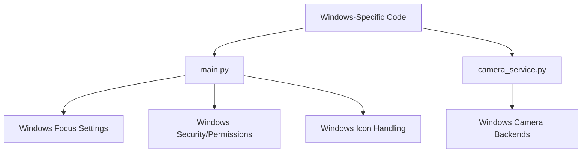
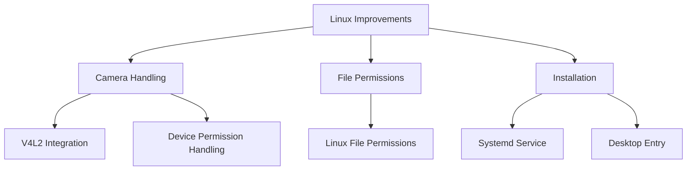

# Linux Migration Plan

## Current Windows-Specific Code Analysis

### 1. Windows-Specific Code Locations

### 2. Required Changes

#### A. main.py

- Remove Windows-specific logging setup (win32security)
- Remove Windows focus configuration (configure_windows_focus method)
- Remove Windows-specific icon handling
- Remove Windows platform checks

#### B. camera_service.py

- Remove Windows-specific camera backends (CAP_DSHOW, CAP_MSMF)
- Simplify camera initialization to use V4L2 (Linux standard)
- Keep Linux camera device path handling (/dev/video\*)

#### C. Build and Installation

- Remove Windows-specific files:
  - build_windows.bat
  - installer.nsi
  - file_version_info.txt
  - app.ico

#### D. Dependencies

- Remove Windows-specific dependencies from requirements.txt:
  - pywin32
  - win32security

#### E. Offline Support Improvements

- Modify SoapClient to handle offline startup gracefully:
  - Make setup_client() non-blocking on startup
  - Add offline mode detection
  - Cache last known good state
  - Implement background connection retry
  - Add connection status indicator in UI

## Linux-Specific Improvements

## Implementation Plan

### 1. First Phase - Remove Windows Code

#### main.py Changes

- Remove win32security import and related code
- Remove configure_windows_focus method
- Update icon handling to use only .png format
- Remove all sys.platform == 'win32' checks

#### camera_service.py Changes

- Remove Windows-specific camera backends
- Enhance V4L2 implementation
- Improve Linux device path handling
- Add better error handling for Linux camera permissions

#### File Cleanup

- Remove all Windows-specific files
- Update .gitignore to remove Windows patterns

#### Dependencies Update

- Remove Windows dependencies from requirements.txt
- Add any Linux-specific dependencies needed

### 2. Second Phase - Linux Optimization

#### Camera Handling

- Enhance V4L2 integration
- Add proper device permission handling
- Improve camera device discovery
- Add fallback mechanisms for different Linux distributions

#### File System Integration

- Implement proper Linux file permissions
- Add logging to system journal
- Create proper data directory structure following Linux standards

#### System Integration

- Create systemd service file for automatic startup
- Add desktop entry file for application launchers
- Implement proper signal handling for Linux

#### Offline Mode Enhancement

- Implement graceful offline startup:
  - Add connection state management
  - Create background connection monitor
  - Add automatic retry mechanism
  - Implement UI indicators for connection status
  - Cache necessary data for offline operation
  - Add sync queue management

### 3. Third Phase - Testing

#### Functionality Testing

- Test camera initialization and capture
- Verify file permissions and access
- Test service installation and auto-start
- Validate logging integration
- Test offline mode operation:
  - Application startup without network
  - Offline punch recording
  - Data synchronization when connection restored
  - UI status indicators

#### System Integration Testing

- Test systemd service functionality
- Verify desktop integration
- Test multi-user scenarios
- Validate device permissions
- Test network state handling:
  - Network disconnection handling
  - Network reconnection handling
  - Data integrity during network transitions

## Migration Steps

1. Create backup of current codebase
2. Remove Windows-specific code
3. Implement Linux optimizations
4. Enhance offline support
5. Test all functionality
6. Create new Linux-specific installation documentation
7. Deploy and validate on test systems

## Success Criteria

1. Application runs successfully on Linux without any Windows dependencies
2. Camera functionality works reliably with V4L2
3. All file operations follow Linux standards
4. System integration (service, desktop entry) works correctly
5. No Windows-specific code or files remain in the codebase
6. Application starts and functions properly in offline mode
7. Data synchronization works reliably when connection is restored
