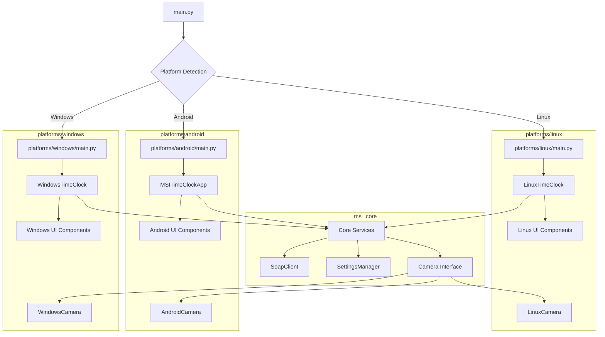

# MSI Time Clock Refactoring Plan for Multi-Platform Support

## 1. Current Architecture Analysis

### Core Business Logic (Platform-Agnostic)

- **SOAP Client** (`soap_client.py`): Handles communication with the MSI WebTrax service
- **Offline Storage** (`offline_storage.py`): Manages local storage of punch data
- **Password Utilities** (`password_utils.py`): Handles password hashing and verification
- **Punch Exceptions** (`punch_exceptions.py`): Defines exception handling for punches

### Platform-Specific Components

- **UI Components** (`time_clock_ui.py`, `admin_panel.py`, `ui_theme.py`, `ui_constants.py`): Currently using customtkinter (Tkinter-based)
- **Camera Service** (`camera_service.py`): Uses OpenCV with platform-specific code for Linux
- **Main Application** (`main.py`): Contains platform-specific window management and UI initialization

## 2. Proposed New Architecture

```
MSIClock2025/
├── msi_core/                           # Shared core module
│   ├── __init__.py
│   ├── soap/                           # SOAP client functionality
│   │   ├── __init__.py
│   │   ├── client.py                   # Platform-agnostic SOAP client
│   │   └── exceptions.py               # SOAP-related exceptions
│   ├── storage/                        # Storage functionality
│   │   ├── __init__.py
│   │   ├── offline_storage.py          # Platform-agnostic storage
│   │   └── db_interface.py             # Abstract database interface
│   ├── auth/                           # Authentication functionality
│   │   ├── __init__.py
│   │   └── password_utils.py           # Password utilities
│   ├── camera/                         # Camera abstraction
│   │   ├── __init__.py
│   │   ├── camera_interface.py         # Abstract camera interface
│   │   ├── camera_linux.py             # Linux implementation
│   │   ├── camera_android.py           # Android implementation
│   │   └── camera_windows.py           # Windows implementation (no-op)
│   ├── config/                         # Configuration management
│   │   ├── __init__.py
│   │   ├── settings_manager.py         # Platform-agnostic settings
│   │   └── platform_detector.py        # Platform detection utilities
│   └── models/                         # Data models
│       ├── __init__.py
│       ├── punch.py                    # Punch data model
│       └── exceptions.py               # Business logic exceptions
│
├── platforms/                          # Platform-specific implementations
│   ├── linux/                          # Linux-specific code
│   │   ├── __init__.py
│   │   ├── main.py                     # Linux entry point
│   │   └── ui/                         # Linux UI (customtkinter)
│   │       ├── __init__.py
│   │       ├── time_clock_ui.py
│   │       ├── admin_panel.py
│   │       └── ui_theme.py
│   ├── android/                        # Android-specific code
│   │   ├── __init__.py
│   │   ├── main.py                     # Android entry point
│   │   └── ui/                         # Android UI (Kivy)
│   │       ├── __init__.py
│   │       ├── time_clock_ui.py
│   │       ├── admin_panel.py
│   │       └── ui_theme.py
│   └── windows/                        # Windows-specific code
│       ├── __init__.py
│       ├── main.py                     # Windows entry point
│       └── ui/                         # Windows UI (customtkinter)
│           ├── __init__.py
│           ├── time_clock_ui.py
│           ├── admin_panel.py
│           └── ui_theme.py
│
├── assets/                             # Shared assets
│   ├── common/                         # Common assets for all platforms
│   │   ├── logo.png
│   │   └── msi_theme.json
│   ├── linux/                          # Linux-specific assets
│   │   └── fonts/
│   ├── android/                        # Android-specific assets
│   │   └── fonts/
│   └── windows/                        # Windows-specific assets
│       └── fonts/
│
├── main.py                             # Universal entry point
├── requirements.txt                    # Common requirements
├── requirements_linux.txt              # Linux-specific requirements
├── requirements_android.txt            # Android-specific requirements
├── requirements_windows.txt            # Windows-specific requirements
└── settings.json                       # Default settings template
```

## 3. Abstract Camera Interface

The camera functionality needs to be abstracted to support different platforms:

```python
# msi_core/camera/camera_interface.py
from abc import ABC, abstractmethod
from typing import Optional, Tuple, Dict, Any
from datetime import datetime
import numpy as np

class CameraInterface(ABC):
    """Abstract base class for camera implementations across platforms"""

    @abstractmethod
    def initialize(self) -> bool:
        """Initialize the camera with configured settings"""
        pass

    @abstractmethod
    def is_initialized(self) -> bool:
        """Check if camera is initialized"""
        pass

    @abstractmethod
    def capture_frame(self) -> Optional[Tuple[np.ndarray, bytes]]:
        """Capture a frame from the camera"""
        pass

    @abstractmethod
    def capture_photo(self, employee_id: str, timestamp: Optional[datetime] = None) -> Optional[bytes]:
        """Capture a photo for an employee punch"""
        pass

    @abstractmethod
    def cleanup(self) -> None:
        """Release camera resources"""
        pass

    @abstractmethod
    def test_camera(self) -> Dict[str, Any]:
        """Test camera functionality and return status"""
        pass
```

## 4. Role of NumPy in the Architecture

NumPy is included in the common requirements because it's essential for image processing across all platforms that implement camera functionality:

1. **Image Representation**: Camera frames are represented as NumPy arrays (`np.ndarray`), which provide efficient storage and manipulation of image data.

2. **Image Processing**: NumPy is used for:

   - Creating placeholder images when the camera is unavailable
   - Resizing and cropping images
   - Processing detection results from the YOLO model
   - Basic image transformations

3. **Cross-Platform Consistency**: By using NumPy arrays as the standard image format in the camera interface, we ensure consistent behavior across all platform implementations.

4. **Data Exchange**: The camera interface methods use NumPy arrays to exchange image data between the camera implementation and the UI components.

Even for the Windows implementation (which doesn't use a real camera), NumPy is still needed to create the placeholder images that maintain API compatibility with the other platforms.

## 5. Platform Detection

```python
# msi_core/config/platform_detector.py
import sys
import os
from enum import Enum, auto

class Platform(Enum):
    """Enum for supported platforms"""
    LINUX = auto()
    ANDROID = auto()
    WINDOWS = auto()
    UNKNOWN = auto()

def detect_platform() -> Platform:
    """Detect the current platform"""
    # Check for Android first (it's also Linux-based)
    if 'ANDROID_STORAGE' in os.environ or 'ANDROID_ROOT' in os.environ:
        return Platform.ANDROID

    # Check for Windows
    if sys.platform.startswith('win'):
        return Platform.WINDOWS

    # Check for Linux
    if sys.platform.startswith('linux'):
        return Platform.LINUX

    # Unknown platform
    return Platform.UNKNOWN
```

## 6. Universal Entry Point

```python
# main.py
#!/usr/bin/env python3
import os
import sys
import logging
from msi_core.config.platform_detector import detect_platform, Platform

def setup_logging():
    """Set up logging configuration"""
    # (Implementation from current main.py)
    pass

def main():
    """Main entry point"""
    # Set up logging
    setup_logging()

    try:
        # Detect platform
        platform = detect_platform()

        # Launch appropriate platform implementation
        if platform == Platform.LINUX:
            from platforms.linux.main import main as linux_main
            linux_main()
        elif platform == Platform.ANDROID:
            from platforms.android.main import main as android_main
            android_main()
        elif platform == Platform.WINDOWS:
            from platforms.windows.main import main as windows_main
            windows_main()
        else:
            logging.error(f"Unsupported platform: {platform}")
            sys.exit(1)

    except Exception as e:
        logging.error(f"Failed to start application: {e}")
        sys.exit(1)

if __name__ == "__main__":
    main()
```

## 7. Architecture Diagram



## 8. Migration Strategy

1. **Create the new directory structure**

   - Create the `msi_core` directory and its subdirectories
   - Create the `platforms` directory and its subdirectories
   - Create the new asset directory structure

2. **Implement the core module**

   - Move and refactor platform-agnostic code into the core module
   - Create abstract interfaces for platform-specific functionality

3. **Implement the Linux platform**

   - Refactor existing code to use the new architecture
   - Ensure all functionality works as before

4. **Implement the Windows platform**

   - Create Windows-specific UI components based on Linux implementation
   - Implement the no-op camera service

5. **Implement the Android platform**

   - Create Kivy-based UI components
   - Implement Android-specific camera service

6. **Update the main entry point**

   - Implement platform detection
   - Add logic to launch the appropriate platform implementation

7. **Test on each platform**
   - Verify functionality on Linux
   - Verify functionality on Windows
   - Verify functionality on Android

## Benefits

This refactoring plan provides a comprehensive approach to supporting multiple platforms while minimizing code duplication. The key benefits include:

1. **Separation of concerns**: Core business logic is separated from platform-specific implementations
2. **Code reuse**: Common functionality is shared across platforms
3. **Maintainability**: Changes to core functionality only need to be made in one place
4. **Extensibility**: New platforms can be added by implementing the required interfaces
